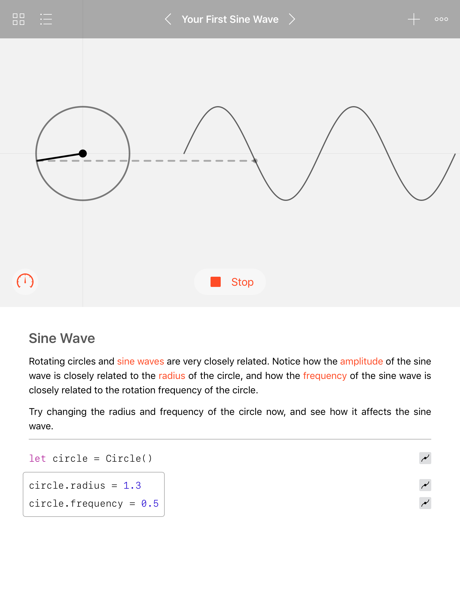
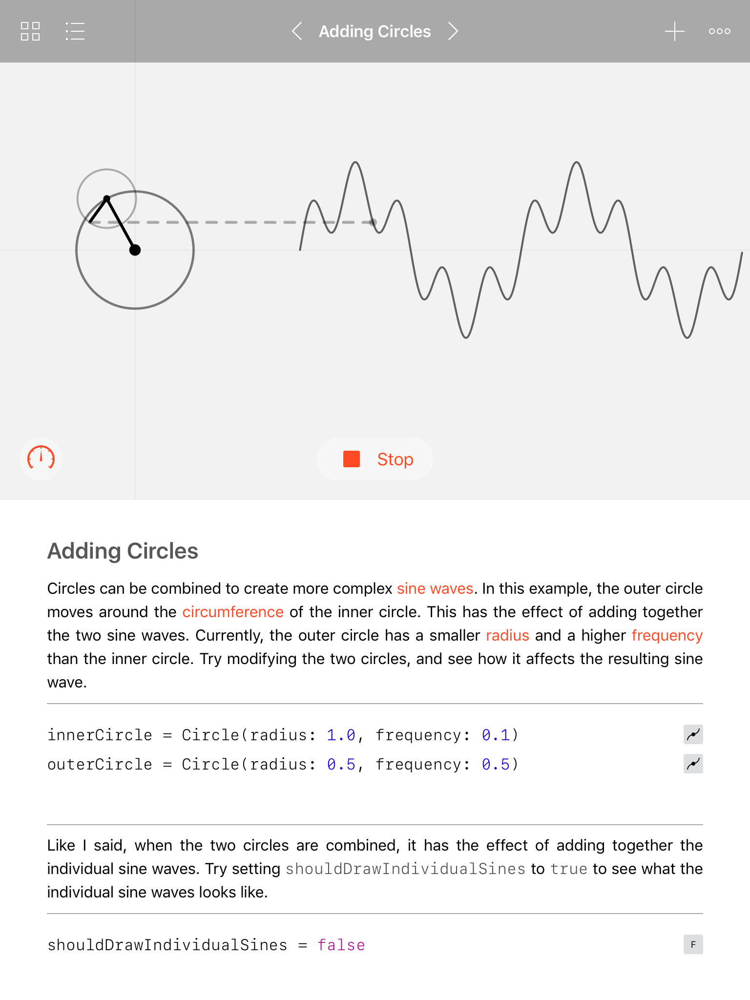
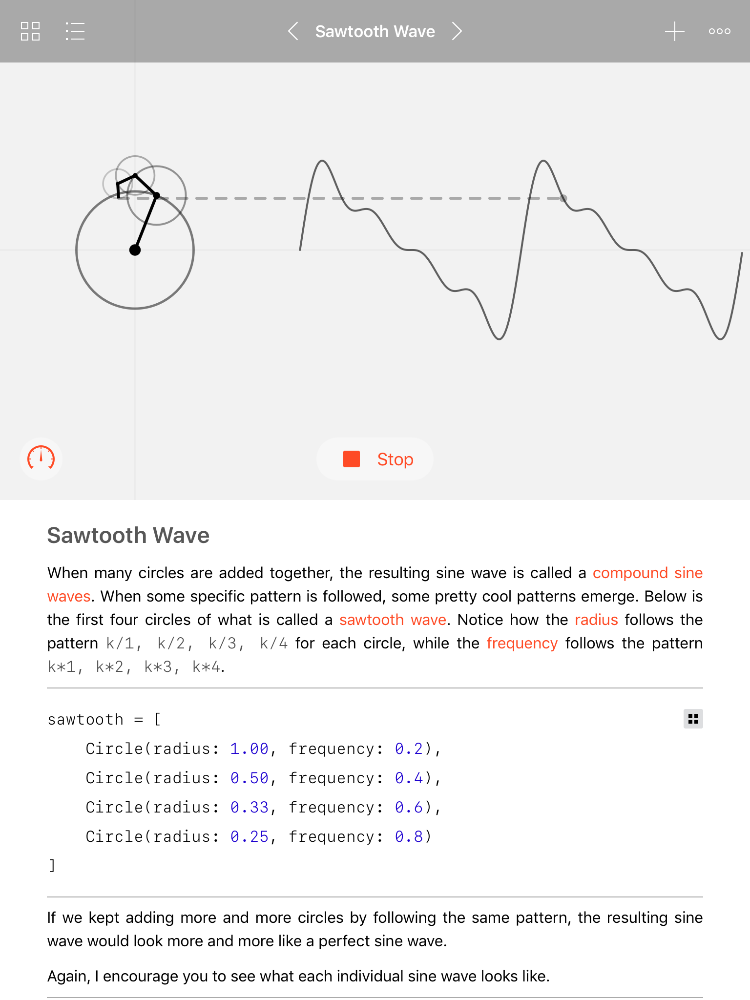

# A World of Circles
This is a Swift Playground Book i wrote for my application for the WWDC 2017 Scholarship. The Plaground Book is a visual guide through the relationship between circles and a sine waves. It starts out with the concept of a circle and how it relates to a sine wave. It then gradually builds up by add more circles until it shows square waves and sawtooth waves. The book is interactive so the reader can change different parameters and see how it affects the result.

## Screenshots
  
